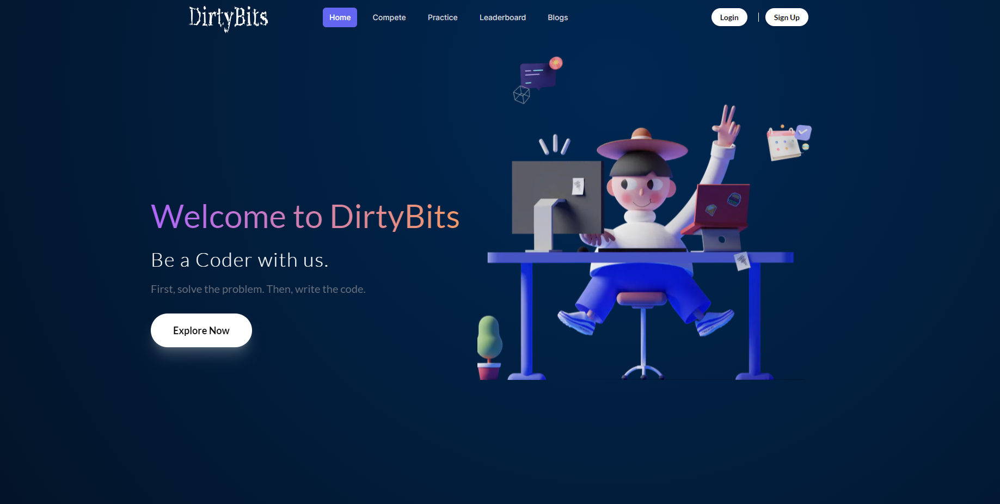

# DirtyBits
#### DirtyBits is the platform to help you enhance your skills, expand your knowledge and prepare for technical interviews.



### Frameworks/Languages/Tools

*   [NextJS](https://nextjs.org/)
*   [ReactJS](https://reactjs.org/)
*   [Redux](https://redux.js.org/)
*   [Django](https://www.djangoproject.com/))

## Installation
1) clone the project
```bash
 git clone 
```
2) install the necessary dependencies
``` bash
npm install
```
3) run the development server
``` bash
npm run dev
```


